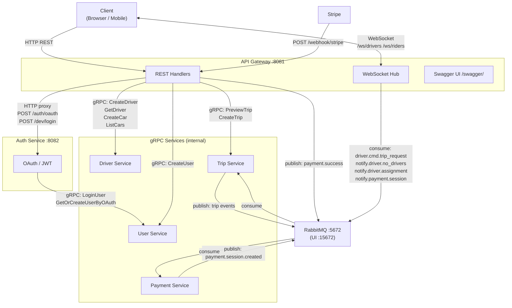

# Service Communication Map

> Update this diagram whenever a new service, gRPC method, or RabbitMQ event is added.

## Ports

| Service        | Port  | Protocol     |
|----------------|-------|--------------|
| API Gateway    | 8081  | HTTP / WS    |
| Swagger UI     | 8081  | HTTP (`/swagger/`) |
| Auth Service   | 8082  | HTTP (internal) |
| Proto Docs     | 8090  | HTTP (Tilt)  |
| RabbitMQ       | 5672  | AMQP         |
| RabbitMQ UI    | 15672 | HTTP         |
| Jaeger UI      | 16686 | HTTP         |
| Trip Postgres  | 30432 | TCP          |
| Driver Postgres| 30433 | TCP          |
| User Postgres  | 30434 | TCP          |

## RabbitMQ Queues

| Queue                              | Producer        | Consumer         | Payload                          |
|------------------------------------|-----------------|------------------|----------------------------------|
| `driver.cmd.trip_request`          | Trip Service    | API GW → Driver  | trip request for nearby drivers  |
| `notify.driver.no_drivers_found`   | Trip Service    | API GW → Rider   | no available drivers             |
| `notify.driver.assignment`         | Trip Service    | API GW → Driver  | driver assigned to trip          |
| `notify.payment.session_created`   | Payment Service | API GW → Rider   | Stripe checkout URL              |
| `payment.success` (exchange)       | API Gateway     | Payment Service  | Stripe checkout completed        |

## gRPC Methods

### UserService
| Method                    | Request fields                                      |
|---------------------------|-----------------------------------------------------|
| `CreateUser`              | username, email, password, role, profile_picture    |
| `UpdateUser`              | user_id, username?, email?, profile_picture?        |
| `LoginUser`               | email, password, role                               |
| `GetUser`                 | user_id                                             |
| `GetOrCreateUserByOAuth`  | email, username, profile_picture, role              |

### DriverService
| Method            | Request fields                                    |
|-------------------|---------------------------------------------------|
| `CreateDriver`    | user_id, name, profile_picture                    |
| `GetDriver`       | user_id                                           |
| `CreateCar`       | user_id, car_plate, package_slug                  |
| `ListCars`        | user_id                                           |
| `RegisterDriver`  | driverID (user_id), car_id, latitude, longitude   |
| `UnRegisterDriver`| driverID (user_id), car_id, latitude, longitude   |

### TripService
| Method        | Request fields                              |
|---------------|---------------------------------------------|
| `PreviewTrip` | userID, startLocation{lat,lon}, endLocation{lat,lon} |
| `CreateTrip`  | rideFareID, userID                          |
