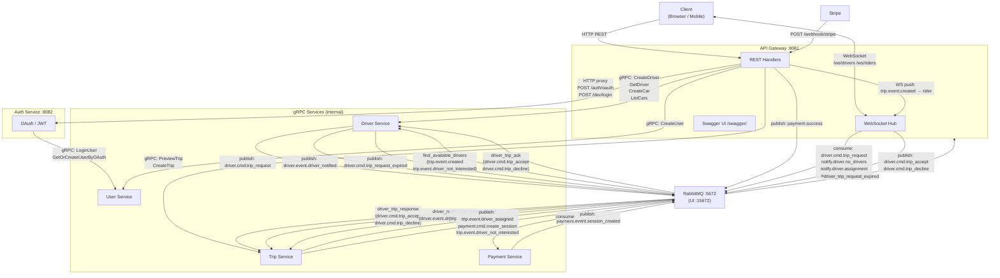
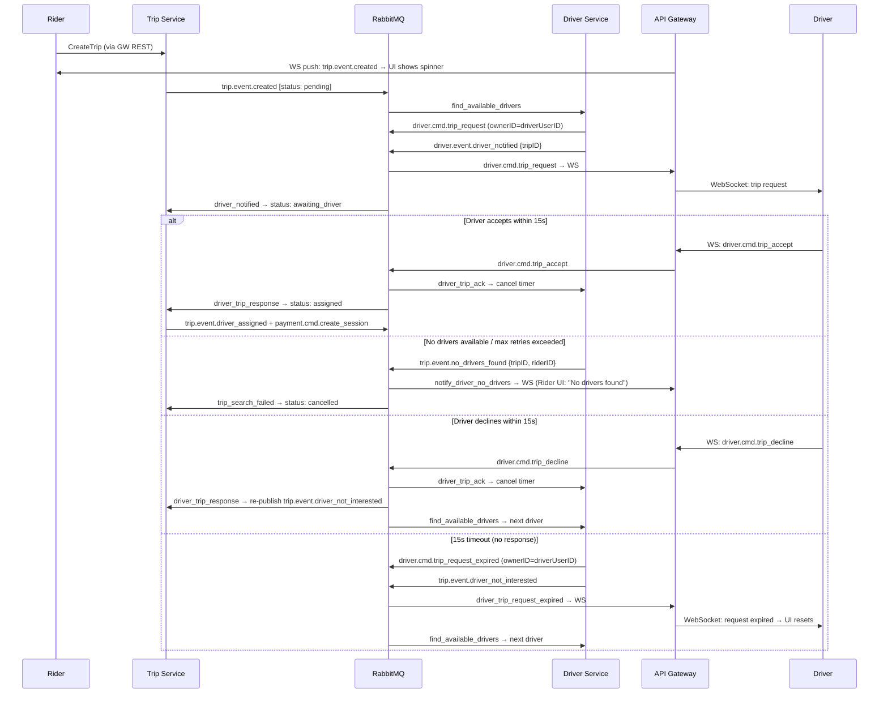

# Service Communication Map

> Update this diagram whenever a new service, gRPC method, or RabbitMQ event is added.

## Driver Accept/Decline Flow (15s timeout)

## Ports

| Service        | Port  | Protocol     |
|----------------|-------|--------------|
| API Gateway    | 8081  | HTTP / WS    |
| Swagger UI     | 8081  | HTTP (`/swagger/`) |
| Auth Service   | 8082  | HTTP (internal) |
| Proto Docs     | 8090  | HTTP (Tilt)  |
| RabbitMQ       | 5672  | AMQP         |
| RabbitMQ UI    | 15672 | HTTP         |
| Jaeger UI      | 16686 | HTTP         |
| Trip Postgres  | 30432 | TCP          |
| Driver Postgres| 30433 | TCP          |
| User Postgres  | 30434 | TCP          |

## RabbitMQ Queues

| Queue                          | Routing key(s)                                          | Producer        | Consumer                      |
|--------------------------------|---------------------------------------------------------|-----------------|-------------------------------|
| `find_available_drivers`       | `trip.event.created`, `trip.event.driver_not_interested`| Trip Svc / Driver Svc | Driver Service          |
| `driver_cmd_trip_request`      | `driver.cmd.trip_request`                               | Driver Service  | API GW → Driver WS            |
| `driver_trip_response`         | `driver.cmd.trip_accept`, `driver.cmd.trip_decline`     | API Gateway     | Trip Service                  |
| `driver_trip_ack`              | `driver.cmd.trip_accept`, `driver.cmd.trip_decline`     | API Gateway     | Driver Service (cancel timer) |
| `driver_notified`              | `driver.event.driver_notified`                          | Driver Service  | Trip Service (status update)  |
| `driver_trip_request_expired`  | `driver.cmd.trip_request_expired`                       | Driver Service  | API GW → Driver WS → reset UI |
| `notify_driver_no_drivers`     | `trip.event.no_drivers_found`                           | Driver Service  | API GW → Rider WS             |
| `trip_search_failed`           | `trip.event.no_drivers_found`                           | Driver Service  | Trip Service (status: cancelled) |
| `notify_driver_assignment`     | `trip.event.driver_assigned`                            | Trip Service    | API GW → Rider WS             |
| `notify_payment_session`       | `payment.event.session_created`                         | Payment Service | API GW → Rider WS             |
| `payment_trip_response`        | `payment.cmd.create_session`                            | Trip Service    | Payment Service               |

## Trip Status Flow

| Status             | Transition                                          |
|--------------------|-----------------------------------------------------|
| `pending`          | Trip created                                        |
| `awaiting_driver`  | Driver notified (`driver.event.driver_notified`)    |
| `awaiting_driver`  | Next driver notified (after decline / timeout)      |
| `assigned`         | Driver accepted (`driver.cmd.trip_accept`)          |
| `cancelled`        | No drivers found (`trip.event.no_drivers_found`)    |

## gRPC Methods

### UserService
| Method                    | Request fields                                      |
|---------------------------|-----------------------------------------------------|
| `CreateUser`              | username, email, password, role, profile_picture    |
| `UpdateUser`              | user_id, username?, email?, profile_picture?        |
| `LoginUser`               | email, password, role                               |
| `GetUser`                 | user_id                                             |
| `GetOrCreateUserByOAuth`  | email, username, profile_picture, role              |

### DriverService
| Method            | Request fields                                    |
|-------------------|---------------------------------------------------|
| `CreateDriver`    | user_id, name, profile_picture                    |
| `GetDriver`       | user_id                                           |
| `CreateCar`       | user_id, car_plate, package_slug                  |
| `ListCars`        | user_id                                           |
| `RegisterDriver`  | driverID (user_id), car_id, latitude, longitude   |
| `UnRegisterDriver`| driverID (user_id), car_id, latitude, longitude   |

### TripService
| Method        | Request fields                              |
|---------------|---------------------------------------------|
| `PreviewTrip` | userID, startLocation{lat,lon}, endLocation{lat,lon} |
| `CreateTrip`  | rideFareID, userID                          |
